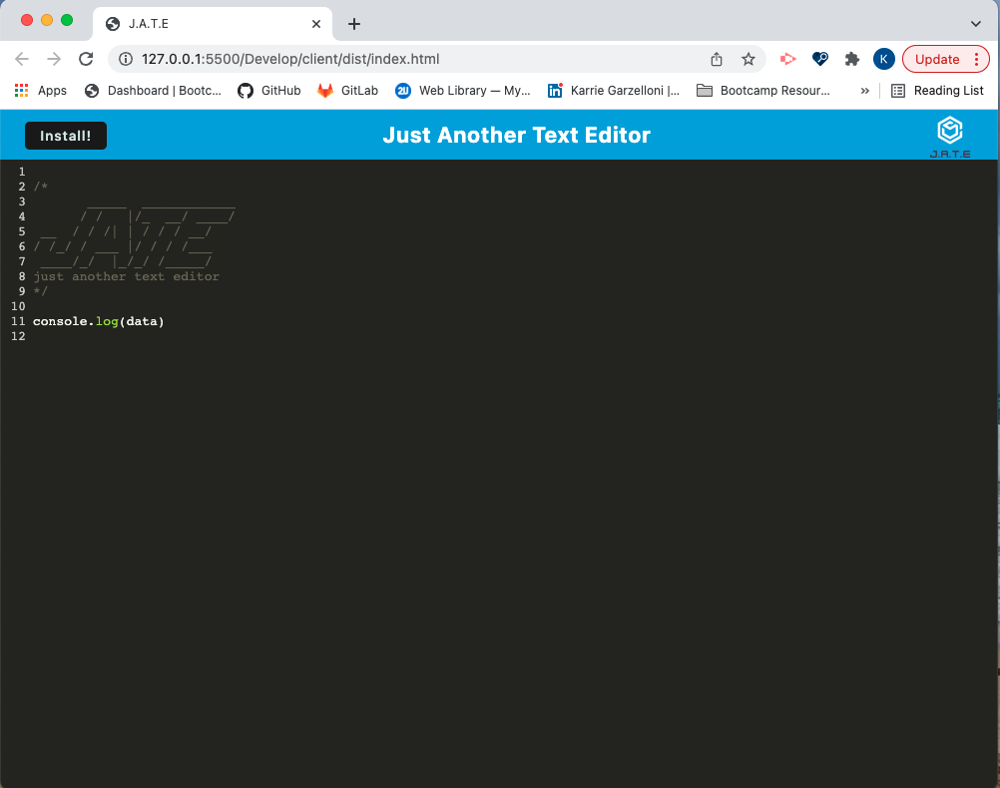

#  J.A.T.E Text Editor
## Karrie Garzelloni 

## The Task

The task for this assignment is to build a text editor that runs in the browser. The app is a single-page application that meets the PWA criteria. This application contains the following features:

  * The application works without an internet connection

  * Automatically saves content inside the text editor when the DOM window is unfocused

  * Bundled with webpack

  * Create a service worker with workbox that Caches static assets

  * The application should use babel in order to use async / await

  * Application must have a generated `manifest.json` using the `WebpackPwaManifest` plug-in

  * Can be installed as a Progressive Web Application

## User Story

```md
AS A developer
I WANT to create notes or code snippets with or without an internet connection
SO THAT I can reliably retrieve them for later use
```

## Installation 

This application requires installation of webpack CLI, express, idb, if-env, nodemon and concurrently dev dependencies. 


## Mock-Up

The following image shows the application's live server:




## Link to GitHub Repository

https://github.com/kgarzelloni/19-text-editor

## Link to Deployed Page on Heroku


## Contact Me
Karrie Garzelloni 
https://github.com/kgarzelloni
